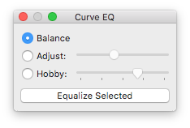
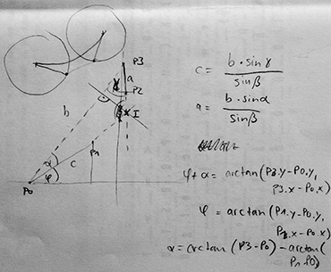

# Curve Equalizer

Curve Equalizer helps you quickly balance the Bézier handles of a curve, or adjust the curvature to a chosen amount.

## Interface

Select the curve adjustment method.

<table>
	<tr>
		<th>Method</th>
		<th>Description</th>
	</tr>
	<tr>
		<td>Balance</td>
		<td>The curvature is not changed, only the length of the handles is distributed evenly between the in- and outgoing handle. This is similar to the «Tunnifier» script by Eduardo Tunni.</td>
	</tr>
	<tr>
		<td>Adjust</td>
		<td>Change the curvature interactively using the slider. This is particularly useful if you want to finely tweak the curvature, while balancing the handles.</td>
	</tr>
	<tr>
		<td>Hobby</td>
		<td>Change the tension of the curves. This uses the spline algorithm by John D. Hobby, which is also used by Metafont to create harmonic curves.</td>
	</tr>
</table>

Click the «Equalize selected» button to apply the adjustment to the selected curves in the current glyph window.

Tip: you can make the window larger, this will give you longer sliders and thus more precision.

## Known Issues

If the angle between the Bézier handles is less than 45°, or the handles are on different sides of the curve, the curvature can’t be changed. This is not a bug.

The modified curves preview is not visible while you hold the Preview keyboard shortcut.

## Geometry

These are my notes from which I derived the trigonometry at work:

Curve Equalizer is © 2013–2021 by Jens Kutilek.

The Hobby Spline code was sent in by Simon Egli with contributions by Juraj Sukop and Lasse Fister.
